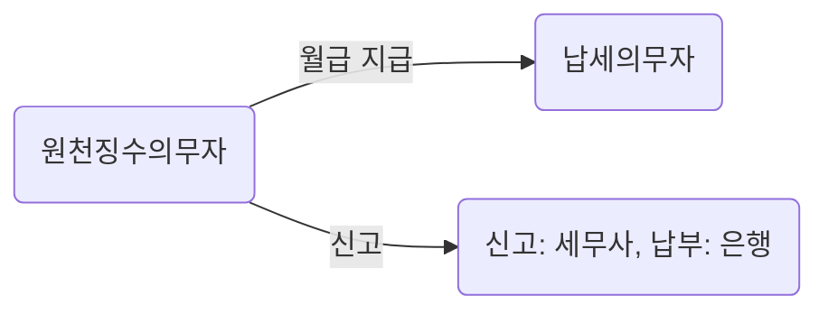

# The United States Tax

Taxable income is gross income less adjustments and allowable tax deductions. Gross income for federal and most states is receipts and gains from all sources less cost of goods sold. Gross income includes "all income from whatever source," and is not limited to cash received.

The U.S. tax system is set up on both a federal and state level. There are several types of taxes: income, sales, capital gains, etc. Federal and state taxes are completely separate and each has its own authority to charge taxes. The federal government doesn't have the right to interfere with state taxation. Each state has its own tax system that is separate from the other states. Within the state there may be several jurisdictions that also charge taxes. For example, counties or towns may charge their own school taxes that are in addition to state taxes. The U.S. tax system is quite complex.

## Income Tax
Every person who earns income in the U.S. is supposed to pay income tax on both the federal and state level. Federal taxes include social security and FICA. Each state also has its own form of income tax that employers also withhold from your paycheck. If you earn over a certain amount, $6,750, you must file both federal and state taxes before April 15th of each year.

| Taxable Income | Tax Rate |
|:---:|:---:|
| $0 – $9,275 |	10% |
| $9,276 – $37,650 |	15% |
| $37,651 – $91,150 |	25% |
| $91,151 – $190,150 |	28% |
| $190,151 – $413,350 |	33% |
| $413,351 – $415,050 |	35% |
| $415,051 and above	| 39.6% |

## Sales Tax
The tax that is charged on your purchases, such as if you buy a pack of gum. Sales tax is a state tax and varies from state to state as well as within the state. For example, NY State Sales Tax is 7% and NJ is 3%, but Albany has 8% sales tax while Syracuse has only 7%.

## Tax Spent On
> Based on 2014 the White House report

| Percent | Spent On | Examples |
| --- | --- | --- |
| 27.49% |Health care	| Medicare for very poor, often disabled people |
| 23.91% |	National defense |	Defending the country; paying soldiers' salaries and weapons |
| 18.17% |	Job and family security |	Programs to give free food, tax credits |
| 9.07% |	Net interest |	The interest the U.S. had to pay to other countries |
| 5.93% |	Veterans' benefits | Pays for health care, home loans, pensions, education |
| 3.59% |	Education and job training | College loan, job training programs, special education |
| 2.00% |	Immigration, law enforcement, and administration of justice | 	 Borders security, lawsuits, other court-related costs |
| 1.85% |	International affairs |	 Humanitarian aid for other countries; spending on U.S. Embassies across the world |
| 1.64% |	Natural resources, energy, and environment | Pollution control, clean energy and environment |
| 1.13% |	Science, space, and technology | 	Scientific research, and the space program |
| 0.97% |	Agriculture |	Help farmer grow crops; agricultural research and insurance |
| 0.43% |	Community, area, and regional development	| Spending on things to make communities stronger, like building housing and community centers |
| 0.39% |	Responding to natural disasters	|  Aid for those have survived a major natural disaster |
| 3.42% |	Other government programs	| Trade, the government |

## Corporate Tax
> A tax credit is a dollar-for-dollar reduction of the income tax you owe. Tax credits reduce the amount of income tax you owe to the federal and state governments.

Corporate income tax is imposed at the federal level

| Taxable income ($) | 	Tax rate |
| --- | --- |
| 0 to 50,000 |	15% |
| 50,000 to 75,000	| $7,500 + 25% Of the amount over 50,000 |
| 75,000 to 100,000	| $13,750 + 34% Of the amount over 75,000 |
| 100,000 to 335,000	| $22,250 + 39% Of the amount over 100,000 |
| 335,000 to 10,000,000	| $113,900 + 34% Of the amount over 335,000 |
| 10,000,000 to 15,000,000	| $3,400,000 + 35% Of the amount over 10,000,000 |
| 15,000,000 to 18,333,333 | 	$5,150,000 + 38% Of the amount over 15,000,000 |
| 18,333,333 and up	 | 35% |

Corporations subject to U.S. tax must file federal and state income tax returns. Different tax returns are required at the federal and some state levels for different types of corporations.

## Individual Tax Return
[Form 1040](https://www.irs.gov/uac/about-form-1040) is the standard Internal Revenue Service (IRS) form that individuals use to file their annual income tax returns. The form contains sections that require taxpayers to disclose their financial income for the year in order to ascertain whether additional taxes are owed or whether the taxpayer is due a tax refund.

Also known as the U.S. individual income tax return or the long form, Form 1040 needs to be filed with the IRS by April 15, and everyone who earns income over a certain threshold must file an income tax return with the IRS. Individuals file one of several versions of Form 1040, while businesses have different forms to report their profits.

## Individual Tax Return For Aliens

If you are a nonresident alien doing business or working in the United States, you are required to file a tax return if your U.S. source income is greater than your personal exemption ($4,000 for 2015).

### Tax Residence

Days of Presence in the United States: Even if you are physically present in the United States, do not count the following days of presence for the substantial presence test –
1) Days you regularly commute to the United States from your residence in Canada or Mexico;
2) Days you are in the United States for less than 24 hours if you are in transit between two places outside the United States;
3) Days you are in the United States as a crew member of a vessel;
4) Days you are unable to leave the United States because of a medical condition that arose while you were in the United States;
5) Days you are an "exempt individual."

**Exempt Individual:** This does not mean you are exempt from tax. It means none of your days in the United States count toward the substantial presence test, so you cannot pass this test and are considered a nonresident alien. You are an exempt individual if you Were you present in the United States by reason of:  

### What Happens If You Don't File?
Studies have shown that most non-immigrant foreigners who are required to file, either do not file a return or file incorrectly. However, and it has also been shown that there is a massive overpayment of U.S. taxes by foreign nationals who do not file, rather than underpayment (J.W. Antenucci, "Widespread Noncompliance and Overpayment of Taxes by Foreign Scholars," Tax Notes, May 13, 1996). Just because your employer has withheld tax from your wages does not mean that you have paid the proper amount. You could have a sizeable refund due!

If you do not have any tax liability, you might be wondering what will happen if you do not file a return.  Well, the IRS will not impose penalties if no tax is due. However, the terms of your visa require you to comply with all laws of the United States, including the requirement to file an income tax return. You might be required to show proof that you filed if you wish to change your visa status, or obtain permanent residency, or regain entry into the United States once you have left.  Don't risk your visa status by failing to comply with this requirement.

### When and Where to File
If you receive wages subject to U.S. tax withholding, the due date for filing your tax return his April 15 of the following year.  If you did not receive taxable wages during the year, the due date for filing your tax return is June 15 of the following year.  Your Form 1040NR or Form 1040NR-EZ (including Form 8843) must be sent to the Department of the Treasury, Internal Revenue Service, Austin TX 73301. See IRS Publication 519 for more information.

Here is a list of all the forms and publications you should need:
 - Form 1040NR and Instructions or Form 1040NR-EZ and Instructions.
 - Form 8843
 - Form 843 (for improperly withheld social security tax)
 - Publication 519
 - Publication 901
 - Publication 597 (if you are from Canada)

#### Reference
http://www.form1040nr.com/filingrequirements.php

#  Republic of Korea Tax
## 국세

> **대한민국 헌법 제 38조:** 모든 국민은 법률이 정하는 바에 의하여 납세의 의무를 진다.

국세는 보통 1세목 1세법주의에 의해 각각의 부과 대상에 따라 각각의 세법이 존재한다. 국세에 관한 법률은 법인세법, 소득세법, 부가가치세법 등이 있으며 이들은 각각 법인의 소득, 개인의 소득, 부가가치대상인 재화용역의 공급을 그 과세대상으로 하고 있으며, 예외적으로 상속세및증여세법은 한개의 법률로 상속과 증여라는 2개의 항목을 과세대상으로 한다.

조세는 국가가 가진 가장 큰 부의 원천이기 때문에 의도적이든 아니든 탈세를 했을 경우에는 무엇을 상상하든, 그 이상의 대가를 치르게 된다. 국세청에서는 국세기본법에 의거하여 체납기간 1년 이상, 체납규모 5억 이상인 경우 개인이든 법인이든 명단을 공개한다. 물론 명단만 공개하고 끝! 이건 당연히 아니고 받아내야 될 건 받아내야 하므로 징수팀이 나서서 체납자 집에 방문하여[3] 재산 모든 것에 빨간딱지(압류)를 붙이게 된다

직접세는 소득과 수입을 바탕으로 국가가 납세의무자에게 직접 징수한다. 월급을 수령하면 뜯어가는 소득세가 대표적

간접세는 소비와 지출을 바탕으로 징수되는 세금이며, 보통 물건을 구입할 때 포함되는 부가가치세가 대표적인 간접세이며, 기름값 오를 때마다 대차게 까이는 유류세도 간접세의 일종. 그냥 물가가 많이 올랐구나 하고 여길 수 있으므로 세금을 올리고 싶은 경우 간접세를 가지고 장난을 칠 수도 있다. 다만 한국의 부가가치세의 경우 1988년 이후 10%로 고정되어있는 상태.

### 국세청
세금을 한 푼이라도 더 뜯어내게 하기 위해 불철주야 노력하는 기관. 지방세와 관세를 제외한 국세(國稅)인 소득세·법인세·부가가치세·개별소비세·상속세·증여세 등을 징수하는데, 국가재정을 충당하는 가장 근원적인 재원이 된다. 이와 같이 국가 재원의 조달이라는 역할을 수행하는 국세청은 세법이 정하는 바에 따라 세금을 부과·징수하게 되는데, 국세청이 하는 일은 크게 2가지 유형으로 나눌 수 있다.

  1. 첫째는 납세자가 세법의 규정에 따라 자신의 납세의무를 제대로 이행할 수 있도록 안내하고 도와주는 서비스 기능으로, 이를 위하여 국세청은 법령해석, 세금해설책자 제작·배부, 세무상담 등의 기능을 수행한다.
  2. 둘째는 모든 납세자가 세법이 정하는 바에 따른 납세의무를 제대로 이행토록 하기 위하여 세금신고·납부자료의 관리·분석, 불성실납세자 선정·조사, 체납자에 대한 세금 강제징수 등의 기능을 수행한다.

`4대 권력기관`으로 불리는 4개의 기관이 있는데 국세청, 국가정보원, 검찰청, 경찰청이 해당된

### 종합소득세
산출 세액 = 과세표준(소득금액 - 소득공제) x 세율

| 과세표준 | 세율 | 비고 |
| --- | --- | --- |
|  1,200만원 이하  | 6% | 최대 72만원 |
| 1,200-4,600만원 | 15% | 72만원 + 1,2000만원 초과분의 15% = 582만원 |
| 4,600-8,800만원 | 24% | 582만원 + 4,600만원 초과분의 24% = 1,590만원 |
| 8,800-1.5억원 | 35% | 1,590만원 + 8,800만원 초과분의 35% = 3,760만원 |
| 1.5억원 초과 | 38% | 3,760만원 + 1.5억원 초과분의 38% |

### 원천징수 (Tax withholding)
원천징수란 상대방의 소득 또는 수입이 되는 금액을 지급할 때 이를 지급하는 자(원천징수의무자)가 그 금액을 받는 사람(납세의무자)이 내야할 세금을 미리 떼어서 대신 납부하는 제도입니다.

원천징수의무자가 원천징수를 하여야 하는 소득은 다음과 같다
 - 이자소득
 - 배당소득
 - 봉급,상여금 등의 갑종근로소득
 - 퇴직급여 등의 갑종퇴직소득
 - 상금,강연료 등 일시적 성질의 기타소득
 - 원천징수 대상 사업소득
 - 음식 ·숙박업소 등의 봉사료

| 대상소득의 종류 | 원청징수 대상소득 | 세율 |
| --- | --- | --- |
| 근로 소득 | 매웗 분의 근로소득 | 기본세율|
| 사업 소득 | 방문교사, 개인판매원, 가수 | 3% |
| 기타 소득 | 기타소득 | 20% |
| 퇴직 소득 | 퇴직 소득 | 기본세율 |
| 봉사류 수입 | 음식, 숙박업 봉사료 수입 | 5% |
| 일용근로자 | 일당 10만원 초과소득 | 6% |
| 이자, 배당 | 돈을 빌려주고 받은 이자 | 14%

### 부가가치세 (Sales Tax)
우리가 마트나 쇼핑몰에서 상품 구입시 카드 영수증을 보면 부가세가 포함되어 있다. 사업자는 상품에 부가세를 포함에서 팔기떄문에 실제 세금은 소비자가 부담한다.

#### 면제
 - 곡물, 과실, 채소, 육류, 생선, 가공되지 않은 식료품
 - 연탄, 무연탄, 복권
 - 병의원등 의료보건 용역업
 - 허가 받은 학원
 - 도서, 신문, 잡지

###사업자등록 인터넷 신청
http://hotdog-life.tistory.com/277
