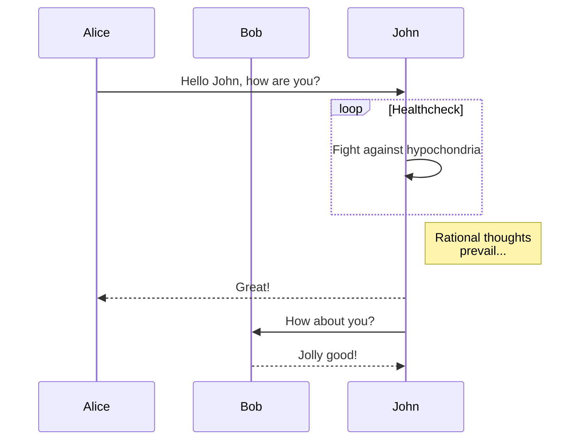
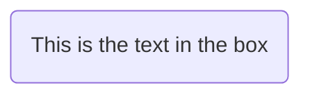
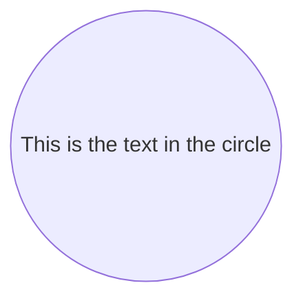
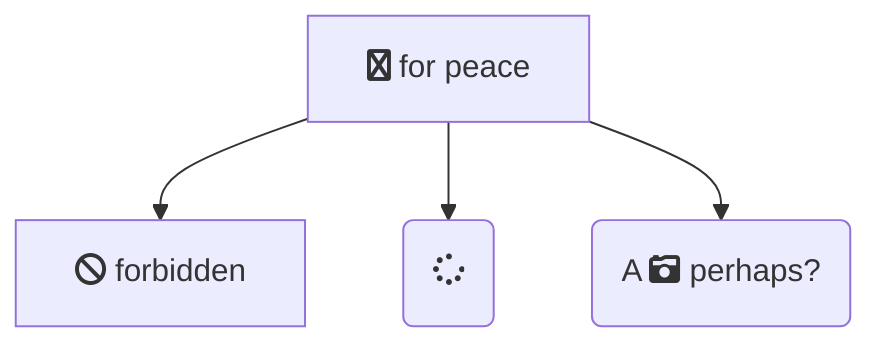
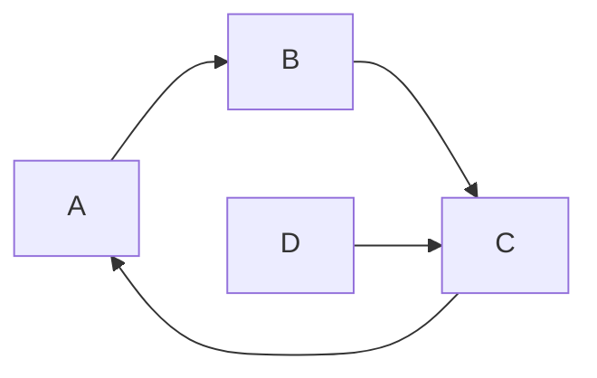
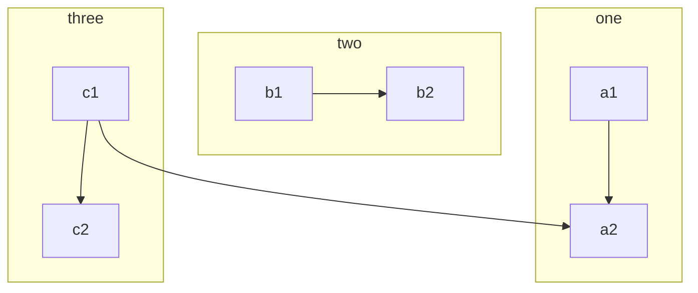
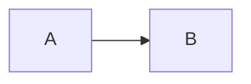

# Education Industry

## Sources of Learning
| Category | Platforms |
| --- | --- |
| Blog | Medium, Ray Wenderlich, App Coda We Heart Swift |
| Q&A | Stack Overflow, Quora |
| Online Course | Treehouse, Stanford, Coursera, Udemy, Devslopes |
| Book | Raywenderlich, Big Nerd Ranch
| eBook | Swift Document |
| Conference | Realm.io |
| YouTube | Let's build that app, The Swift Guy | 

Take a look at this video:



