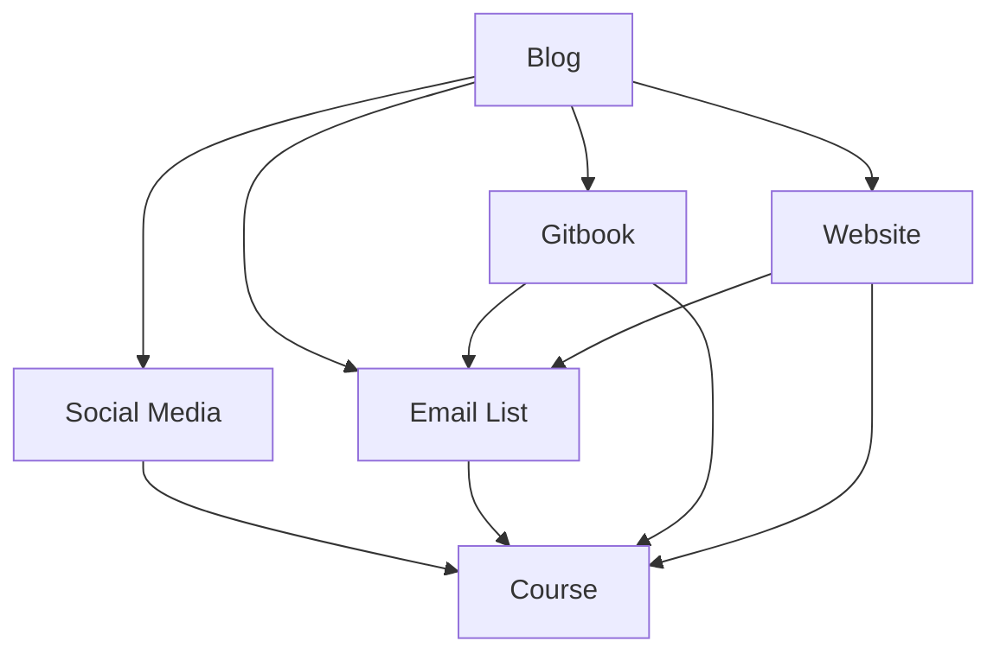

# Execution
Become the #1 iOS instructor and equate the Swift Programming Language with Bob the Developer.

 
 

## Current Revenue Stream {#revenue}

### 1. Swift Online Courses
| Course Title | URL | Process | Price |
| --- | --- | --- | --- |
|  Intermediate Swift with Bob | learnswiftwithbob.com | Current | $50 |
| The UIKit Fundamentals with Bob | learnuikitwithbob.com | Not yet | $50 |
| Functional Programming, MVVM, and RxSwift with Bob | learnrxswiftwithbob.com | Not yet | $50 |
| Test Driven iOS Development with Bob | testdrivenioswithbob.com | Not yet | $50 |
| Algorithm and Data Structure in Swift with Bob | learnalgorithmwithbob.com | Not yet |  $50 |

### 2. Affiliate Sales
| Platform | Sources |
| --- | --- |
| Amazon Associates | Personal website, GitBook documents |
| Udemy Affiliate Partners | VIPs, email list |
| Others | Digital Ocean, Bluehost, Envato, TransferWise, Wrike, Adobe |

### 3. Instructor Partnership
Partner up and create translated courses with a 20/80 split (Korean, Arabic, Portuguese, Amazon, Indian)

## Sales Funnels
| Platform | Public| Personal |
| --- | --- | --- |
| Blog | Call-to-action to learnswiftwithbob.com, social media funnels, email list sign up | Comment engagement |
| Email | Regular personal update, convert people to email list | Reply and relationship buildings with VIPs  and email list |
| Facebook | Facebook post update, iOS Developer Group | Bob the Developer and iOS Developer Facebook message |
| Gitbook | Content, Youtube videos, source code, email list invite | Comment engagement |
| LinkedIn |Group announcement | Personal share, comment engagement |
| Thunderclap | Social advertisement | Not available |
| Twitter | Article share | Direct message, engagement |
| Instagram | Daily story, post | Direct message |
| YouTube | Course preview, personal update | Comment engagement, Direct message |

> The number one goal is to get to know them at an individual level. Bring each to the email list and engage.

## Advertisement
Theme: Personal story and document my journey. Facebook, LinkedIn, Twitter, YouTube, Google AdWord, Instagram, Thunderclap

 
 

# Roles {#roles}

## Bob the Developer
|  Role | Detail |
| --- | --- |
| Blogger and Instructor | Online courses and blog articles |
| Marketer | Engagement with readers and affiliates and email list, advertisement |
| Mediator | Communicate between designers and the development team |
| HR Manager | Payroll, Raise money, employee benefits, interviews |
| Captain | Set the purpose and vision. Know the why |

## Employees
Founding members consist of

| Job | Roles | Tools | Requirement |
| --- | --- | --- | --- |
| Web Developers | Build website with React, Node, Express, MongoDB | JIRA, Trello, Scrum, Mac | Be able to read and write English, one scrum master |
| UX/UI Designer | Design graphics for books, websites | Sketch, Animation, heydesigner.com | Workflow and animation with Sketch |
| Part-time | Document, book keeping, logistics | Trello | Be able to execute and responsible |
| Outsourcing | Video editing, video filming, After Effect | Upwork, Trello | Communication |

 
 

# Strategy {#strategy}
I work towards providing a platform for people to publish and learn.

## Phase 1
 > Create a platform for people to publish articles and tutorials. However, they register and get interviewed in order to publish in the early stage to ensure quality. They may earn money through affiliate links both from Amazon and Udemy.

### MVP Features
| Bloggers | Readers | Both |
| --- | --- | --- |
| Markdown/text editor like Medium |  Content from followers | Mention, tags, recommended people |
| Syntax highlighting |  Highlighting | Comment, notification |
| Send mass emails to followers | Bookmarks |  Stat, affiliate sales |

> Large companies and institution may be interested in direct messages to increase their brand awareness and generate revenue.

### Value Proposition

### Supporting Articles
  - Markdown tutorial
  - How to send mass emails that work
  - Marketing in 2017: Relationship building
  - The purpose and vision
  - Affiliate structure and payment
  - How to write a tutorial even if it is technical

### Scale Model
 | Model | How |
 | --- | --- |
 | Staff on Demand | UX/UI Design outside |
 | Community & Cloud | Publishing platform and cloud computing |
 | Algorithm | Email service, interest |
 | Leveraged Asset | People's knowledge and Content |
 | Engagement | Through comments and open source projects |

## Phase II
 > Create a platform for people to upload videos and make online courses.

### Value Proposition

### GitBook like publishing platform
Allow anyone to use it including those who are creating open-source so that other startups join and start publishing and get to know about the place. We are all about providing great platform. Also the software people can upload tutorials on the platform and generate revenue as well. They could share updates through the blog as well.  

### MVP Features
| Feature | Benefits on Students | Benefits on Instructors | Notes |
| --- | --- | --- | --- |
| Direct Messaging | Ask questions directly | Build connections | No spam message allowed. Personal usage |
| Private online tutoring | Personal help | Extra income | Brings the world together. This is what makes a difference. Personal connection is appreciated.  |
| Q&A Section | Ask questions directly and use leveraged asset | Through answering, instructors may gain personal brand and exposure | Bring new people to the website through Google Search |

> I will work towards providing AR/VR

 The ability to manage students and collect email lists if students agree | Q&A Section |
| Q&A Section to ask for help | Increase personal brand through Q&A |  

### Phase III
 > Create a platform for everyone. Attempt to replace colleges. Focus on practical knowledge. Give people the power to produce content and generate revenue. We should charge %20 for the revenue that instructors earns. No heavy discounting. If can, implement VR/AR.

Open source, community, platform
